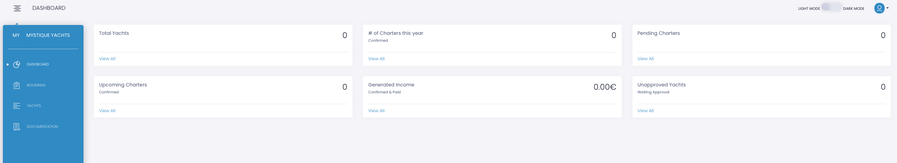
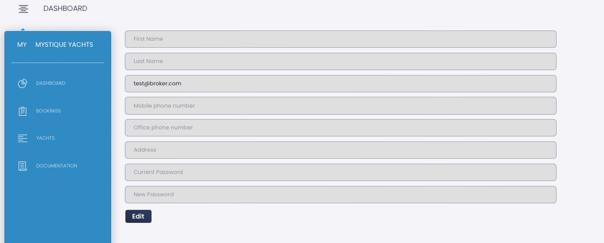

Upon logging in, you will be directed to your account dashboard,

#####

presenting a comprehensive overview of your key data.

Positioned at the top right of the page is a control for toggling between light and dark modes, as well as a link to access your profile. 
Clicking on the profile image provides options to either log out or navigate to the profile page.

Kindly populate the profile page with your relevant information.

