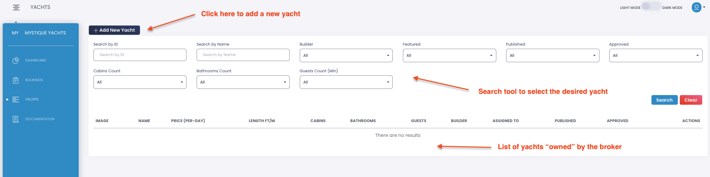
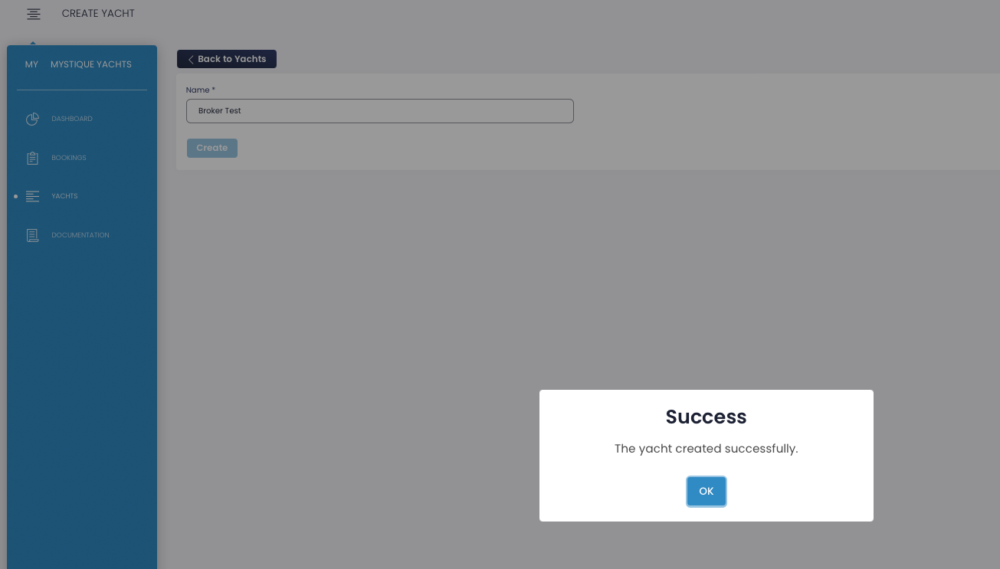
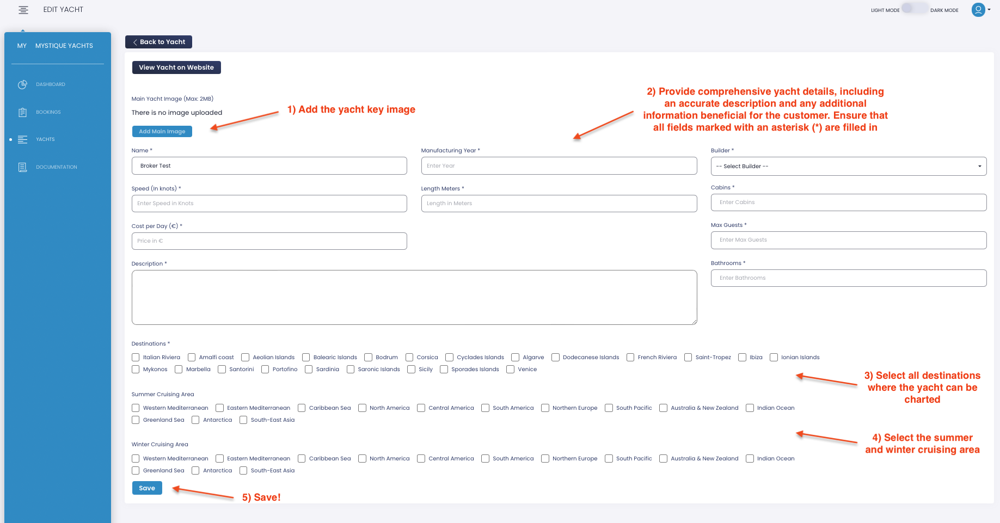
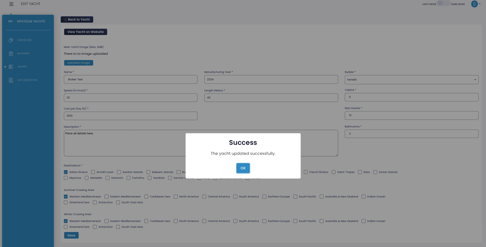
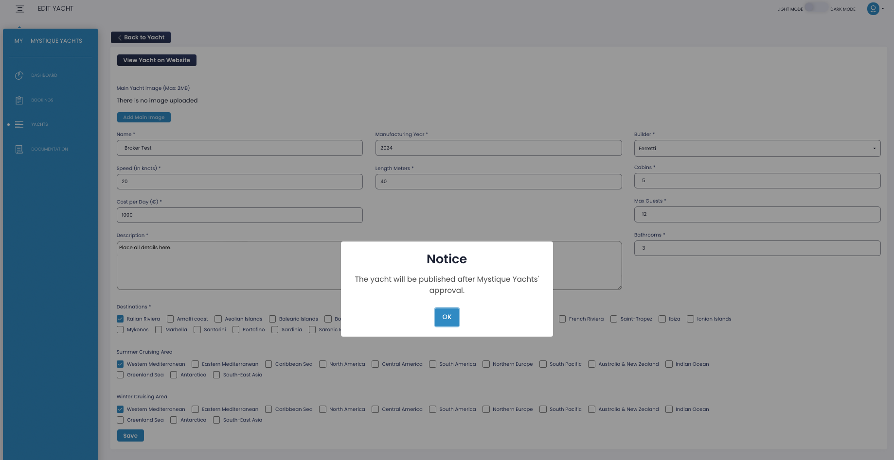
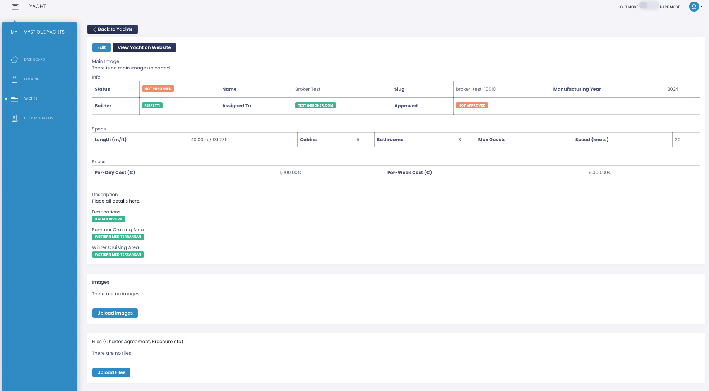

Clicking on the "Yachts" tab will lead you to a summary page displaying all the yachts under your management.

Utilize the search tool at the top of the page to filter and select the desired yachts (currently empty in this tutorial).

Adding new yachts is a breeze—simply click on **Add New Yachts** to proceed to the next page:

Enter the yacht's name and click **Create**

Upon clicking **OK**, you'll be directed to the yacht detail page, where you can input all pertinent yacht details.

Once you click on **Save**, a confirmation popup window will appear, verifying that all information has been successfully saved in the system.

Upon clicking **OK**, another popup window will inform you that the yacht will be published only after approval from Mystique Yachts.

**Mystique Yachts will promptly review all provided information and proceed to publish the yacht on the website**.
You will be notified by email once the yacht is approved by Mystique Yachts.

Upon selecting **OK**, you will be directed to a summary page where you can modify the entered information, incorporate additional yacht images, and upload PDF documents such as the yacht brochure or charter agreement. An email notification will be sent to you once the changes have been approved by Mystique Yachts.

You will also receive an email when Mystique Yachts publishes the yacht on the website.
